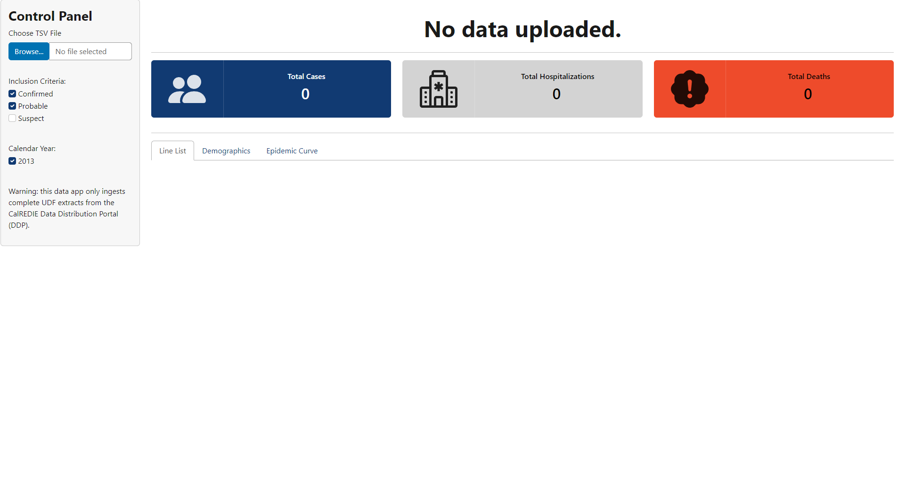

```{r setup, include=FALSE}
knitr::opts_chunk$set(echo = TRUE)
```

**Last Updated:** `r format(as.Date(Sys.Date()), "%m/%d/%Y")`<br> **Built with:** R Version `r getRversion()`

## Overview

Shiny App intended for epidemiologists working in California at the county level. Features included in this build are basic but can be expanded by adding maps (static/interactive), download buttons, and other filtering options.

{width="843"}

## How it Works

Make a copy of the repository and publish to your local instance of Posit Connect. App will run without Posit Connect, but sharing options will be limited.

Shiny app is limited to ingesting Complete UDF Exports from the CalREDIE Data Distribution Portal. Begin by uploading the file to the app, then select your inclusion criteria and years for further filtering. All case counts are aggregated at the calendar year and month level, which may deviate from other reporting methods.

Any feedback or questions about modifications: [eshearer\@ochca.com](mailto:eshearer@ochca.com){.email}
